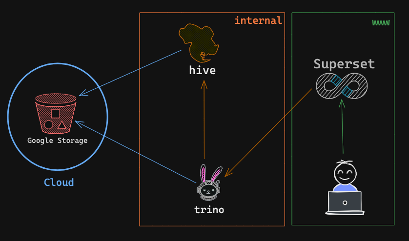
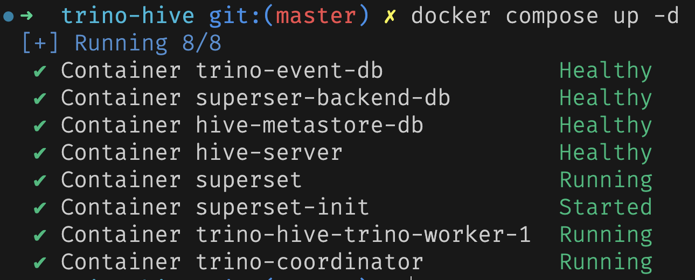
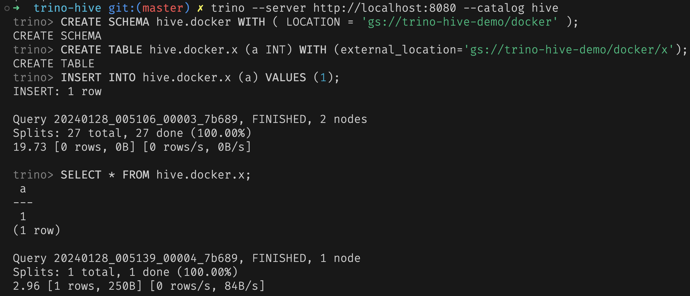
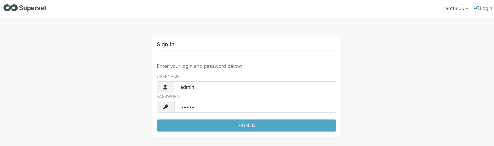
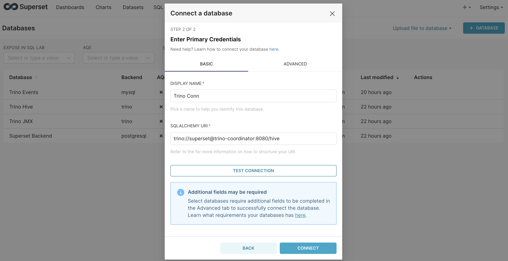
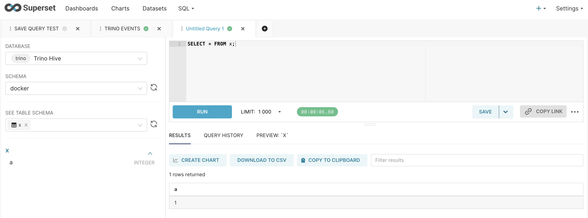

## Hive Metastore Integration with Trino

This github repository describes a simple way to integrate `Hive Metastore` with `Trino`.

### Considerations

- This integration uses `Google Storage` as the storage backend for Hive Metastore.
- Used latest stable version of `Trino` which is `433`.
- Used hive metastore version `2.3.1` and corresponding supported version of Hadoop `2.10.1`
- Used latest stable version of Superset which is `2.1.3`. (3.x.y version showing incorrect version number on UI)

### Trino Configuration

- Used `mysql` event listener to capture the query events from Trino. [Read Docs](https://trino.io/docs/current/admin/event-listeners-mysql.html)
- Fault Tolerant execution of queries: using `TASK` retry policy. [Read Docs](https://trino.io/docs/current/admin/fault-tolerant-execution.html)
- Exchange Manager configuration for Fault Tolerant execution. [Read Docs](https://trino.io/docs/current/admin/fault-tolerant-execution.html#exchange-manager)
- JMX setup for monitoring Trino. [Read Docs](https://trino.io/docs/current/admin/jmx.html?highlight=jmx)
- `Google Cloud Storage` as the storage backend for Hive Metastore. [Read Docs](https://trino.io/docs/current/connector/hive-gcs-tutorial.html)

### Superset Configuration

- Used `postgres` as the backend database for Superset. [Read Docs](https://superset.apache.org/docs/installation/configuring-superset#using-a-production-metastore)
- Customize superset image for adding `trino` driver. [Read Docs](https://superset.apache.org/docs/databases/installing-database-drivers)
- Adding Trino connection to Superset. [Read Docs](https://superset.apache.org/docs/databases/trino/)
- Superset Initialization in Docker Container. [Dockerhub Guide](https://hub.docker.com/r/apache/superset)

### Hive Metastore Configuration

- Used `mysql` as the metadata database for Hive Metastore. [Youtube Guide](https://www.youtube.com/watch?v=5XQOK0v_YRE)
- Used `Google File System` as the Hadoop File System for Hive Metastore. [Github Guide](https://github.com/GoogleCloudDataproc/hadoop-connectors/blob/master/gcs/INSTALL.md)
- Used custom Hive Image for running `hiveserver2` and `hive metastore` together in a single container. Read more about `hiverserver2` and `hive thrift server` [here](https://stackoverflow.com/questions/49799838/hive-service-hiveserver2-metastore-service)

---

### Architecture (Docker Compose)



---

### Running the project locally

#### Prerequisites

- Make sure you have a service account with access to a GCS bucket.

```xml
<!-- hive/core-site.xml -->

<property>
        <name>fs.gs.project.id</name>
        <value>{{YOUR GCP PROJECT}}</value>
</property>
```

- Get your HMAC keys from GCP console and add them to `exchange-manager.properties` file.

```properties
# trino/common/exchange-manager.properties

exchange.base-directories={{YOUR BUCKET NAME}}
exchange.s3.region={{YOUR BUCKET REGION}}
exchange.s3.aws-access-key={{HMAC ACCESS KEY}}
exchange.s3.aws-secret-key={{HMAC SECRET KEY}}
```

- Put your service account JSON file as `gcp-sa.json` in `secrets` directory.
- Working directory should be as follows:

```txt
.
├── docker-compose.yml
├── hive
│   ├── Dockerfile
│   ├── core-site.xml
│   ├── docker-entrypoint.sh
│   └── hive-site.xml
├── issues
├── secrets
│   └── gcp-sa.json
├── superset
│   ├── Dockerfile
│   ├── docker-init.sh
│   └── superset_config.py
└── trino
    ├── Dockerfile
    ├── catalog
    │   ├── hive.properties
    │   └── jmx.properties
    ├── common
    │   └── exchange-manager.properties
    ├── coordinator
    │   ├── config.properties
    │   ├── jmx-config.yaml
    │   ├── jvm.config
    │   └── mysql-event-listener.properties
    └── worker
        └── config.properties
```

#### Running the services

```bash
docker compose up -d
```



#### Executing query with Trino CLI

```bash
trino --server http://localhost:8080 --catalog hive
```



#### Access Superset

Login to Superset using `admin` as username and `admin` as password.



#### Create new Database Connection in Superset (Postgres, Trino, MySQL)



#### Run SQL query in Superset



---

### Superset Troubleshooting

- [Could not load database driver: TrinoEngineSpec](https://github.com/apache/superset/issues/13640)
- [Superset Docker](https://github.com/apache/superset/blob/adc247b7e4fade7ef0d68cb07df5e3aa6bf9a677/docker/docker-bootstrap.sh)
- [cannot open a new editor tab](https://github.com/apache/superset/issues/24228)

---

### Acknowledgements

- [Youtube @dataengineeringvideos](https://www.youtube.com/@dataengineeringvideos)

---

Made with ❤️ by [sambhav8695](https://github.com/sambhav8695)
